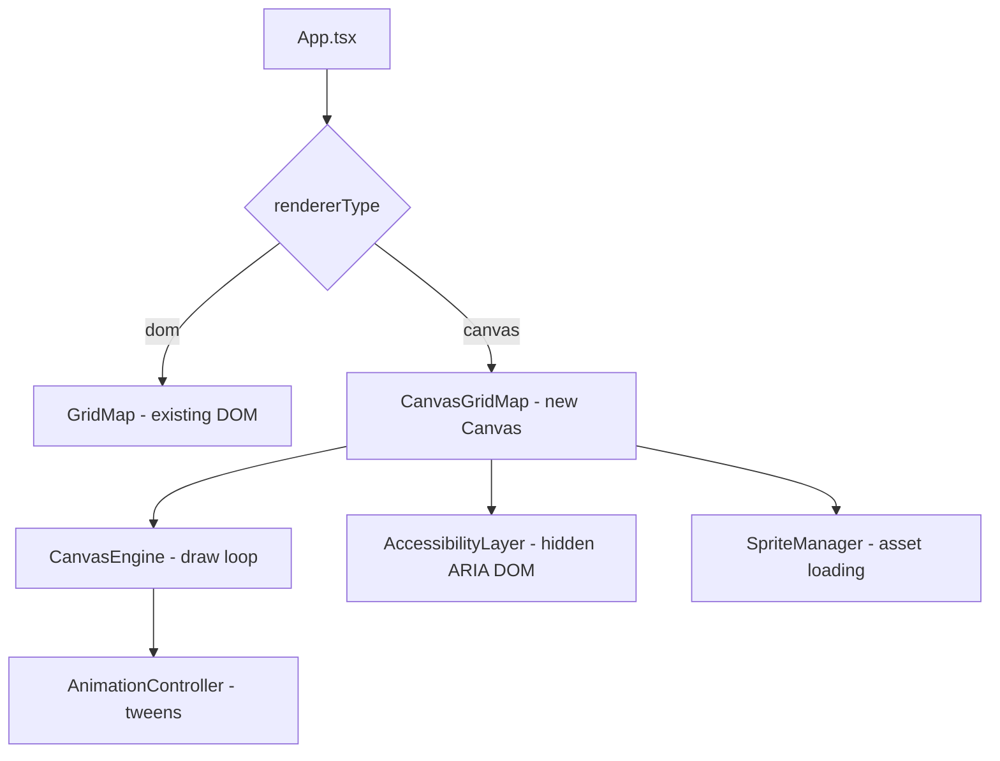
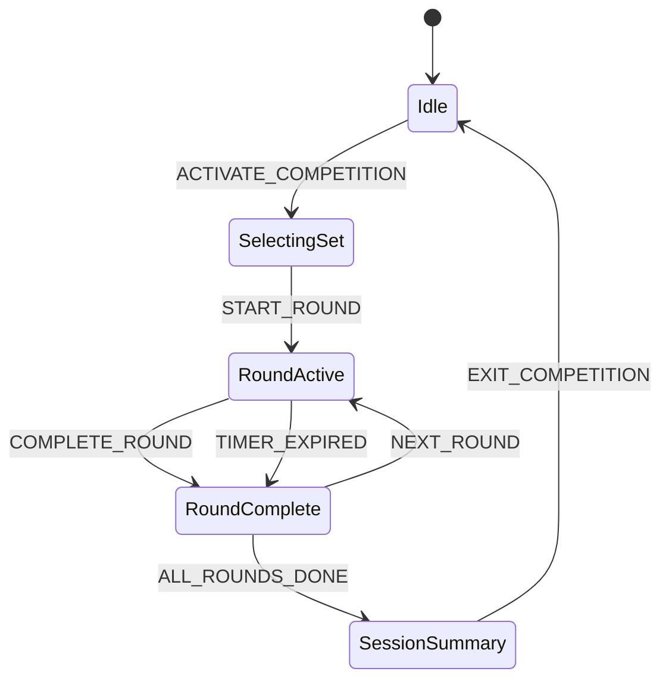

# Design Document: Canvas Grid & Competition Mode

## Overview

This design covers four major feature areas for the Matatalab Coding Set Simulator:

1. **HTML5 Canvas Renderer** — Replace the DOM-based `GridMap` with a `<canvas>` 2D renderer for smoother animations, sprite-based graphics, and better performance on low-end devices. The existing DOM renderer is preserved as a fallback via a toggle.
2. **Kid-Friendly Visual Overhaul** — Cartoon-style SVG block icons, playful UI theme with rounded fonts, pastel gradients, and bouncy micro-animations targeting ages 4–9.
3. **Competition Practice Mode** — Timed rounds, sequential challenge sets with increasing difficulty, scoring (goal + collectibles + efficiency + speed bonuses), star ratings, and localStorage-based progress tracking. Modeled after Hong Kong primary school Matatalab competitions.
4. **Random Maze Generation** — Seeded, deterministic maze generator producing `ChallengeConfig`-compatible layouts with guaranteed solvability, configurable difficulty, and JSON export/import.

All new features support bilingual UI (Traditional Chinese / English) via the existing i18next infrastructure and coexist with the current DOM renderer through a renderer abstraction layer.

## Architecture

The system extends the existing React + TypeScript + Vite stack. Key architectural decisions:

### Renderer Abstraction

A `RendererType` union (`'dom' | 'canvas'`) controls which renderer is active. Both renderers accept the same `GridMapProps` interface. The canvas renderer is a new `CanvasGridMap` component that manages its own `<canvas>` element, animation loop (`requestAnimationFrame`), and a hidden accessibility DOM mirror.



### Competition Mode State

Competition mode is managed by a new `CompetitionState` object within `SimulatorState`, controlled by new reducer actions. The competition flow is:



### Maze Generator

A pure function module (`src/core/mazeGenerator.ts`) with no side effects. Uses a seeded PRNG (mulberry32) for deterministic output. The generation algorithm:

1. Place start at a corner/edge cell
2. Place goal at ≥50% max Manhattan distance from start
3. Randomly place obstacles respecting density constraints
4. Place collectibles on non-obstacle, non-start, non-goal cells
5. Validate solvability via BFS (start → all collectibles → goal)
6. If unsolvable, remove random obstacles and retry (max 50 iterations)
7. Output a `ChallengeConfig` object

## Components and Interfaces

### New Components

| Component | Path | Purpose |
|---|---|---|
| `CanvasGridMap` | `src/components/CanvasGridMap/CanvasGridMap.tsx` | Canvas-based grid renderer with animation loop |
| `AccessibilityLayer` | `src/components/CanvasGridMap/AccessibilityLayer.tsx` | Hidden ARIA DOM mirror for screen readers |
| `CompetitionDashboard` | `src/components/CompetitionDashboard/CompetitionDashboard.tsx` | Round info, timer, score display during competition |
| `CompetitionSummary` | `src/components/CompetitionSummary/CompetitionSummary.tsx` | End-of-session results, star rating, personal best |
| `CompetitionHistory` | `src/components/CompetitionHistory/CompetitionHistory.tsx` | Past session list from localStorage |
| `MazeControls` | `src/components/MazeControls/MazeControls.tsx` | Seed input, grid size, difficulty, generate/export buttons |

### Modified Components

| Component | Changes |
|---|---|
| `Toolbar` | Add competition mode toggle, renderer toggle |
| `BlockIcon` | Replace with cartoon-style SVG icons |
| `BlockInventory` | Add category mascot badges, cartoon headers |
| `ControlBoard` | Bouncy placement animation, placeholder icons |
| `ChallengeSelector` | Support competition challenge sets, random maze indicator |
| `App.tsx` | Integrate renderer switch, competition state, maze generator |

### Key Interfaces

```typescript
// Renderer toggle
type RendererType = 'dom' | 'canvas';

// Competition mode types
interface CompetitionSession {
  id: string;
  date: string;
  challengeSetId: string;
  challengeSetName: Record<'zh' | 'en', string>;
  tier: CompetitionTier;
  rounds: CompetitionRound[];
  totalScore: number;
  starRating: 1 | 2 | 3;
}

type CompetitionTier = 'beginner' | 'intermediate' | 'advanced';

interface CompetitionRound {
  roundNumber: number;
  challengeId: string;
  isRandom: boolean;
  score: RoundScore;
  completed: boolean;
  timeUsed: number;
}

interface RoundScore {
  goalReached: boolean;
  basePoints: number;
  collectibleBonus: number;
  efficiencyBonus: number;
  speedBonus: number;
  total: number;
}

interface CompetitionState {
  active: boolean;
  currentSession: CompetitionSession | null;
  currentRoundIndex: number;
  timeLimit: number; // seconds per round, default 180
  challengeSet: CompetitionChallengeSet | null;
}

interface CompetitionChallengeSet {
  id: string;
  title: Record<'zh' | 'en', string>;
  description: Record<'zh' | 'en', string>;
  skillFocus: 'orientation' | 'navigation' | 'collection' | 'combined';
  tier: CompetitionTier;
  challenges: CompetitionChallengeEntry[];
  recommendedTimePerChallenge: number;
}

interface CompetitionChallengeEntry {
  type: 'predefined' | 'random';
  challengeConfig?: ChallengeConfig; // for predefined
  mazeParams?: MazeGeneratorParams;  // for random
}

// Maze generator types
interface MazeGeneratorParams {
  width: number;       // 4–8
  height: number;      // 4–8
  difficulty: 'easy' | 'medium' | 'hard';
  collectibles: number; // 0–5
  seed?: number;
}

interface MazeGeneratorResult {
  config: ChallengeConfig;
  seed: number;
}
```

### Canvas Engine Interfaces

```typescript
interface CanvasGridMapProps extends GridMapProps {
  collectedItems?: Position[];
}

interface SpriteSheet {
  obstacle: HTMLImageElement[];  // rock, tree, bush variants
  goal: HTMLImageElement;        // animated flag
  collectible: HTMLImageElement; // glowing star
  startZone: HTMLImageElement;   // home-base indicator
}

interface TweenState {
  fromX: number; fromY: number;
  toX: number; toY: number;
  fromAngle: number; toAngle: number;
  progress: number; // 0–1
  duration: number;
  easing: (t: number) => number;
}
```


### New Reducer Actions

```typescript
// Additional SimulatorAction variants
type SimulatorAction =
  | /* ...existing actions... */
  | { type: 'SET_RENDERER'; renderer: RendererType }
  | { type: 'ACTIVATE_COMPETITION'; challengeSet: CompetitionChallengeSet }
  | { type: 'DEACTIVATE_COMPETITION' }
  | { type: 'START_ROUND' }
  | { type: 'COMPLETE_ROUND'; score: RoundScore }
  | { type: 'NEXT_ROUND' }
  | { type: 'GENERATE_MAZE'; params: MazeGeneratorParams }
  | { type: 'LOAD_GENERATED_MAZE'; result: MazeGeneratorResult };
```

## Data Models

### Extended SimulatorState

```typescript
interface SimulatorState {
  /* ...existing fields... */
  renderer: RendererType;
  competition: CompetitionState;
}
```

### Score Calculation

Scoring formula per round:
- **Base points**: 100 if goal reached, 0 otherwise
- **Collectible bonus**: 20 points per collected item
- **Efficiency bonus**: `max(0, 50 - (stepCount - optimalSteps) * 5)` — rewards fewer steps
- **Speed bonus**: `max(0, floor(timeRemaining / timeLimit * 50))` — rewards faster completion
- **Maximum possible per round**: `100 + (collectibleCount * 20) + 50 + 50`

### Star Rating Calculation

- 1 star: Session completed (all rounds attempted)
- 2 stars: Total score ≥ 60% of maximum possible score
- 3 stars: Total score ≥ 85% of maximum possible score

### localStorage Schema

```typescript
// Key: 'matatalab-competition-history'
interface StoredCompetitionHistory {
  version: 1;
  sessions: CompetitionSession[];
  personalBests: Record<string, number>; // challengeSetId → best total score
}
```

### Maze Difficulty Parameters

| Difficulty | Obstacle Coverage | Grid Sizes | Collectibles |
|---|---|---|---|
| Easy (初級) | 0–15% | 4×4 to 5×5 | 0–1 |
| Medium (中級) | 15–25% | 5×5 to 6×6 | 1–3 |
| Hard (高級) | 25–35% | 6×6 to 8×8 | 2–5 |

### Competition Tier Mapping

| Tier | Grid Range | Obstacles | Description |
|---|---|---|---|
| Beginner (初級) | 4×4 – 5×5 | 0–2 | Basic navigation, no collectibles |
| Intermediate (中級) | 5×5 – 6×6 | 2–4 | Obstacles with collectibles |
| Advanced (高級) | 6×6 – 8×8 | 4–6 | Multiple collectibles, multi-step goals |

### Seeded PRNG

The maze generator uses mulberry32, a simple 32-bit seeded PRNG:

```typescript
function mulberry32(seed: number): () => number {
  let s = seed | 0;
  return () => {
    s = (s + 0x6D2B79F5) | 0;
    let t = Math.imul(s ^ (s >>> 15), 1 | s);
    t = (t + Math.imul(t ^ (t >>> 7), 61 | t)) ^ t;
    return ((t ^ (t >>> 14)) >>> 0) / 4294967296;
  };
}
```

This ensures deterministic maze generation: same seed + same params = identical `ChallengeConfig`.

### ChallengeConfig Extension for Generated Mazes

Generated mazes reuse the existing `ChallengeConfig` interface with an additional optional field:

```typescript
interface ChallengeConfig {
  /* ...existing fields... */
  generationSeed?: number; // present only for generated mazes
}
```

### i18n Key Structure for New Features

New keys are added under namespaces:

```
competition.*    — mode toggle, dashboard, scoring terms
maze.*           — generator UI, difficulty labels
challengeSet.*   — set titles, descriptions, skill focus labels
```

Both `src/i18n/zh.json` and `src/i18n/en.json` are extended with these namespaces.


## Correctness Properties

*A property is a characteristic or behavior that should hold true across all valid executions of a system — essentially, a formal statement about what the system should do. Properties serve as the bridge between human-readable specifications and machine-verifiable correctness guarantees.*

### Property 1: Canvas scaling preserves 1:1 cell aspect ratio

*For any* viewport dimensions and grid size (4×4 to 10×10), the canvas scaling function shall produce cell dimensions where width equals height (1:1 aspect ratio), and the total canvas fits within the viewport without scrolling.

**Validates: Requirements 1.7**

### Property 2: Accessibility DOM structure mirrors grid state

*For any* grid state (including bot position, obstacles, goals, collectibles, and collected items), the hidden accessibility DOM shall contain exactly `width × height` gridcell elements with ARIA roles and labels matching the current cell contents, and the ARIA live region shall reflect the bot's current position.

**Validates: Requirements 3.1, 3.2, 3.4**

### Property 3: Canvas aria-label reflects grid dimensions and bot position

*For any* grid dimensions (width, height) and bot position (row, col), the `aria-label` attribute on the `<canvas>` element shall contain the grid dimensions and the bot's current row and column.

**Validates: Requirements 3.3**

### Property 4: Block icon minimum size

*For any* block type in the Block_Icon_System, the rendered SVG icon shall have dimensions of at least 32×32 pixels.

**Validates: Requirements 4.8**

### Property 5: Bot movement tween duration matches speed setting

*For any* speed setting (slow, normal, fast) and bot movement event, the tween animation duration shall equal the corresponding `SPEED_DELAYS` value for that speed setting.

**Validates: Requirements 2.1**

### Property 6: Competition rounds are ordered by increasing difficulty

*For any* competition challenge set, the challenges shall be ordered such that each subsequent round's difficulty is greater than or equal to the previous round's difficulty (where easy < medium < hard, and grid size is non-decreasing).

**Validates: Requirements 6.3**

### Property 7: Competition timer enforcement

*For any* competition round with a configured time limit, the default time limit shall be 180 seconds, and when the countdown reaches zero, the round shall be marked as complete with the current score recorded and the session shall advance to the next round.

**Validates: Requirements 6.4, 6.5**

### Property 8: Score calculation correctness

*For any* combination of goal reached (boolean), collectibles gathered (0–5), step count, optimal step count, time remaining, and time limit, the score calculation shall produce: base points = 100 if goal reached else 0, collectible bonus = 20 × items collected, efficiency bonus = max(0, 50 − (stepCount − optimalSteps) × 5), speed bonus = max(0, floor(timeRemaining / timeLimit × 50)), and total = sum of all components.

**Validates: Requirements 6.6**

### Property 9: Star rating calculation

*For any* total score and maximum possible score, the star rating shall be: 3 stars if total ≥ 85% of max, 2 stars if total ≥ 60% of max, 1 star otherwise (session completed).

**Validates: Requirements 8.4**

### Property 10: Competition session summary correctness

*For any* set of completed competition rounds, the session summary shall contain per-round scores that sum to the total score, and the star rating shall match the star rating calculation applied to the total score and maximum possible score.

**Validates: Requirements 6.7**

### Property 11: Competition tier parameter bounds

*For any* competition challenge generated for a given tier, the grid dimensions and obstacle count shall fall within the tier's specified ranges: Beginner (4×4–5×5, 0–2 obstacles), Intermediate (5×5–6×6, 2–4 obstacles), Advanced (6×6–8×8, 4–6 obstacles).

**Validates: Requirements 6.8**

### Property 12: Challenge set loading initializes round tracking

*For any* competition challenge set with N challenges, selecting the set shall initialize the competition state with N rounds, all marked as not completed, with the current round index at 0.

**Validates: Requirements 7.2**

### Property 13: Challenge set display data completeness

*For any* competition challenge set, the display data shall include a bilingual title (zh and en), a bilingual description, the number of challenges, and the recommended time per challenge.

**Validates: Requirements 7.3**

### Property 14: Competition block inventory restriction

*For any* competition challenge, the block inventory shall be restricted to the values specified in the challenge's `blockInventory` config, merged with defaults for any unspecified block types.

**Validates: Requirements 7.4**

### Property 15: Competition history persistence round-trip

*For any* completed competition session, persisting the session to localStorage and then loading from localStorage shall produce a session object equivalent to the original (date, challenge set name, per-round scores, total score, star rating).

**Validates: Requirements 8.1, 8.2**

### Property 16: Personal best detection

*For any* completed session where the total score exceeds the stored personal best for that challenge set, the system shall flag the result as a new personal best.

**Validates: Requirements 8.3**

### Property 17: Generated maze structural validity

*For any* valid grid size (4×4 to 8×8) and maze generator parameters, the generated maze shall contain exactly one start position, at least one goal position, and the specified number of collectibles (0–5), with no overlapping positions between start, goals, obstacles, and collectibles.

**Validates: Requirements 9.1**

### Property 18: Generated maze solvability

*For any* generated maze, there shall exist at least one valid path from the start position through all collectible positions to the goal position, without passing through any obstacle cell.

**Validates: Requirements 9.2, 9.3**

### Property 19: Maze difficulty controls obstacle density

*For any* generated maze with a given difficulty, the obstacle count as a percentage of total cells shall fall within: easy 0–15%, medium 15–25%, hard 25–35%.

**Validates: Requirements 9.4**

### Property 20: Maze start/goal placement constraints

*For any* generated maze, the start position shall be on a corner or edge cell, and the Manhattan distance between start and goal shall be at least 50% of the maximum possible Manhattan distance for the grid dimensions.

**Validates: Requirements 9.5**

### Property 21: Generated maze ChallengeConfig compatibility

*For any* generated maze, the output shall be a valid `ChallengeConfig` object that passes the existing `parseChallenge` validation when serialized to JSON and re-parsed.

**Validates: Requirements 9.7**

### Property 22: Deterministic seed generation

*For any* valid seed value and maze generator parameters, generating a maze with the same seed and parameters twice shall produce identical `ChallengeConfig` objects.

**Validates: Requirements 10.1, 10.2**

### Property 23: Mixed challenge set composition

*For any* configured ratio of random to predefined challenges in a competition challenge set, the resulting set shall contain the correct proportion of each type (within ±1 due to rounding), and each entry shall be correctly typed as 'predefined' or 'random'.

**Validates: Requirements 11.1, 11.2**

### Property 24: Random competition rounds use appropriate difficulty

*For any* competition round that uses a random maze, the generated maze's difficulty shall match the difficulty tier appropriate for that round's position in the session.

**Validates: Requirements 11.3**

### Property 25: Maze serialization round-trip

*For any* valid generated maze `ChallengeConfig` (including the generation seed), serializing to JSON and then deserializing shall produce an equivalent `ChallengeConfig` object.

**Validates: Requirements 12.3, 12.4**

### Property 26: Bilingual i18n completeness

*For any* i18n key added for competition mode, maze generation, challenge set titles/descriptions, and scoring terms, both the `zh` and `en` translation files shall contain a non-empty string value for that key.

**Validates: Requirements 13.1, 13.2, 13.3, 13.5**

### Property 27: Renderer switch preserves state

*For any* simulator state, switching the renderer between 'dom' and 'canvas' shall not alter the grid state, bot position, bot direction, or execution state.

**Validates: Requirements 14.2**

## Error Handling

| Scenario | Handling |
|---|---|
| Browser lacks Canvas 2D support | Detect via `canvas.getContext('2d')` check. Fall back to DOM renderer, display bilingual info message. (Req 14.5) |
| localStorage unavailable or full | Wrap all localStorage calls in try/catch. Display bilingual warning toast. Continue operating without persistence. (Req 8.5) |
| Invalid maze JSON import | Pass through `parseChallenge()` validation. Display bilingual error message with details. Leave current challenge unchanged. (Req 12.5) |
| Maze generation fails (no solvable layout after max retries) | Return error result from generator. Display bilingual message suggesting different parameters. |
| Timer expires during competition round | Stop execution immediately. Record partial score. Auto-advance to next round or show results. (Req 6.5) |
| Competition session data corruption in localStorage | Validate stored data on load. If invalid, reset history and display warning. |
| Canvas resize during animation | Debounce resize handler (100ms). Re-scale canvas and continue animation from current frame. |
| Seed input validation | Accept only non-negative integers. Display inline validation error for invalid input. |

## Testing Strategy

### Property-Based Testing

The project already uses `fast-check` (v4.1.1) with `vitest`. All correctness properties above will be implemented as property-based tests.

**Configuration:**
- Library: `fast-check` (already installed)
- Runner: `vitest` (already installed)
- Minimum iterations: 100 per property test
- Each test tagged with: `Feature: canvas-grid-competition-mode, Property {N}: {title}`

**Key property test files:**
- `src/core/__tests__/mazeGenerator.property.test.ts` — Properties 17–22, 25
- `src/core/__tests__/scoreCalculation.property.test.ts` — Properties 8, 9, 10, 16
- `src/core/__tests__/competitionState.property.test.ts` — Properties 6, 7, 11, 12, 14, 23, 24, 27
- `src/core/__tests__/competitionPersistence.property.test.ts` — Property 15
- `src/core/__tests__/i18nCompleteness.property.test.ts` — Property 26
- `src/components/__tests__/accessibilityLayer.property.test.ts` — Properties 2, 3
- `src/components/__tests__/canvasScaling.property.test.ts` — Property 1
- `src/components/__tests__/blockIcon.property.test.ts` — Property 4
- `src/components/__tests__/canvasAnimation.property.test.ts` — Property 5

### Unit Testing

Unit tests complement property tests for specific examples, edge cases, and integration points:

- **Maze generator edge cases**: Minimum grid (4×4), maximum grid (8×8), zero collectibles, maximum collectibles, edge-only start positions
- **Score calculation examples**: Perfect score, zero score, partial completion, timer expired scenarios
- **Star rating boundaries**: Exactly 60%, exactly 85%, just below thresholds
- **Serialization edge cases**: Empty obstacles, maximum collectibles, special characters in titles
- **Competition flow integration**: Full session lifecycle from activation through all rounds to summary
- **Renderer toggle**: Switch during idle, switch during execution, switch with error state
- **i18n**: Language switch updates all visible text, missing key fallback behavior
- **localStorage**: Full storage, corrupted data, concurrent access
- **Canvas fallback**: Mock missing Canvas 2D context, verify DOM renderer activation

### Test Organization

```
src/
  core/__tests__/
    mazeGenerator.test.ts              # Unit tests
    mazeGenerator.property.test.ts     # Property tests (Props 17-22, 25)
    scoreCalculation.test.ts           # Unit tests
    scoreCalculation.property.test.ts  # Property tests (Props 8, 9, 10, 16)
    competitionState.test.ts           # Unit tests
    competitionState.property.test.ts  # Property tests (Props 6, 7, 11, 12, 14, 23, 24, 27)
    competitionPersistence.property.test.ts  # Property test (Prop 15)
    i18nCompleteness.property.test.ts  # Property test (Prop 26)
  components/__tests__/
    accessibilityLayer.property.test.ts  # Property tests (Props 2, 3)
    canvasScaling.property.test.ts       # Property test (Prop 1)
    blockIcon.property.test.ts           # Property test (Prop 4)
    canvasAnimation.property.test.ts     # Property test (Prop 5)
    CompetitionDashboard.test.tsx         # Unit tests
    CompetitionSummary.test.tsx           # Unit tests
    MazeControls.test.tsx                 # Unit tests
    CanvasGridMap.test.tsx                # Unit tests
```
