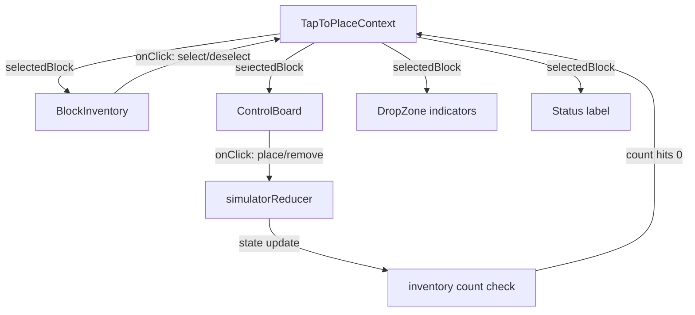
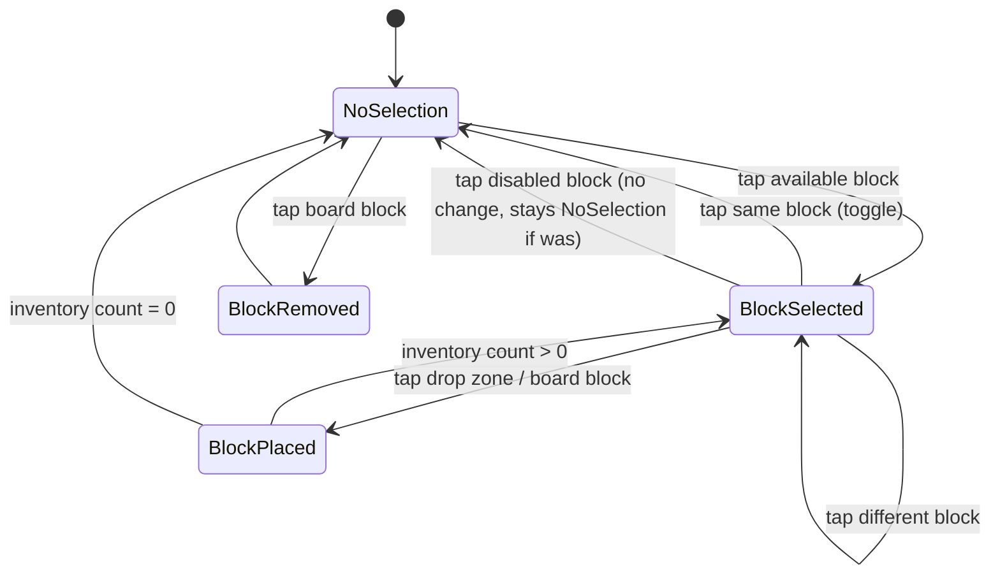

# Design Document: iPad Touch Interaction

## Overview

This feature adds a tap-to-place interaction mode to the Matatalab Simulator, complementing the existing drag-and-drop system. The core idea: tap a block in the inventory to select it, then tap a position on the control board to place it. This eliminates the precision and fatigue issues of drag-and-drop on touch devices while keeping the desktop experience unchanged.

The feature also includes tap-to-remove (tap a placed block to remove it), visual feedback for the selection state, touch-optimized target sizing (44×44px minimum), responsive iPad layout adjustments, browser gesture prevention, and full keyboard/screen-reader accessibility for the new interaction mode.

The implementation layers a new `TapToPlaceContext` on top of the existing `simulatorReducer` state management. No changes to the core reducer logic are needed — the tap interactions dispatch the same `PLACE_BLOCK` and `REMOVE_BLOCK` actions that drag-and-drop already uses.

## Architecture

The tap-to-place mode is implemented as a React context (`TapToPlaceContext`) that manages a single piece of UI state: the currently selected block type (or `null`). Components read this context to determine behavior:

- **BlockInventory** blocks gain `onClick` handlers that set/toggle the selected block.
- **ControlBoard** drop zones and blocks gain `onClick` handlers that either place the selected block or remove a tapped block, depending on selection state.
- **Visual feedback** components (selection indicator, drop zone highlights, status label) render conditionally based on the context value.



### Key Design Decisions

1. **Context over reducer state**: The selected block is UI-only state (not part of the program/simulation model), so it lives in a React context rather than the `simulatorReducer`. This keeps the core state clean and avoids unnecessary re-renders of the grid/execution system.

2. **Coexistence with drag-and-drop**: Both interaction modes work simultaneously. The `@dnd-kit` PointerSensor has an `activationConstraint.distance: 8` which means a simple tap (no movement) won't trigger a drag. Taps are handled by `onClick`, drags by `@dnd-kit`.

3. **Touch detection via CSS media queries**: Touch-specific sizing uses `@media (pointer: coarse)` rather than JavaScript user-agent sniffing. This correctly targets touch-primary devices and avoids false positives on desktop.

4. **Browser gesture prevention**: Applied via CSS `touch-action` properties on interactive panels and a `gesturestart` event listener for iOS pinch-to-zoom. This is scoped to the interactive areas only — non-interactive page areas retain normal scrolling.

## Components and Interfaces

### New: TapToPlaceContext

```typescript
interface TapToPlaceContextValue {
  selectedBlock: BlockType | null;
  selectBlock: (blockType: BlockType) => void;
  deselectBlock: () => void;
}
```

**Provider**: `TapToPlaceProvider` wraps the app inside `DndContext`. It manages `selectedBlock` state and exposes `selectBlock`/`deselectBlock`. When a block is placed and its inventory count reaches 0, the provider auto-deselects.

### Modified: BlockInventory

- Each `DraggableBlock` gains an `onClick` handler:
  - If the block is disabled (count 0): no-op.
  - If the block is already selected: deselect.
  - Otherwise: select this block type.
- A `selected` CSS class is applied when the block matches `selectedBlock`.
- `aria-pressed` attribute reflects selection state.
- Keyboard activation (Enter/Space) triggers the same selection logic.

### Modified: ControlBoard

- Each `DropZone` gains an `onClick` handler:
  - If `selectedBlock` is set: dispatch `PLACE_BLOCK` at this position.
  - If `selectedBlock` is null: no-op.
- Drop zones get a `visible` CSS class when `selectedBlock` is set, making them larger and highlighted.
- Each `SortableBlock` gains an `onClick` handler:
  - If `selectedBlock` is set: dispatch `PLACE_BLOCK` before this block's position.
  - If `selectedBlock` is null: dispatch `REMOVE_BLOCK` for this block.
- `ProgramLineRow` empty line tap: dispatch `PLACE_BLOCK` at position 0.
- `tabIndex={0}` and `role="button"` on drop zones when active.
- Keyboard activation (Enter/Space) triggers placement.

### New: SelectionStatusLabel

A small component rendered near the control board that shows "Selected: [block name]" when a block is selected. Uses an ARIA live region (`aria-live="polite"`) so screen readers announce selection changes.

### New: useTouchDevice hook

```typescript
function useTouchDevice(): boolean
```

Returns `true` if the device has a coarse pointer (touch-primary). Uses `window.matchMedia('(pointer: coarse)')`. Used to conditionally apply touch-specific behaviors in JS (e.g., preventing gestures).

### Modified: App.tsx

- Wraps content with `TapToPlaceProvider` inside the `DndContext`.
- Adds `usePreventGestures()` hook for browser gesture prevention on interactive panels.
- Adds ARIA live region container for screen reader announcements.

### New: usePreventGestures hook

```typescript
function usePreventGestures(ref: React.RefObject<HTMLElement>): void
```

Attaches `touchmove` (with `{ passive: false }` for pull-to-refresh prevention), `gesturestart`/`gesturechange` (iOS pinch-to-zoom), and sets `touch-action: manipulation` on the referenced element. Only active on touch devices.

## Data Models

No new persistent data models are introduced. The tap-to-place feature uses only transient UI state:

```typescript
// Transient UI state in TapToPlaceContext
interface TapToPlaceState {
  selectedBlock: BlockType | null;  // Currently selected block type, or null
}
```

The feature reuses existing data types from `src/core/types.ts`:

- `BlockType` — the type of block selected in the inventory
- `SimulatorAction` — specifically `PLACE_BLOCK` and `REMOVE_BLOCK` actions, already defined
- `Record<BlockType, number>` — the block inventory, used to check counts for auto-deselect

### State Transitions




## Correctness Properties

*A property is a characteristic or behavior that should hold true across all valid executions of a system — essentially, a formal statement about what the system should do. Properties serve as the bridge between human-readable specifications and machine-verifiable correctness guarantees.*

### Property 1: Tapping an available block selects it

*For any* block inventory state and *for any* block type with count > 0, tapping that block should result in it becoming the selected block, regardless of whether another block was previously selected or no block was selected.

**Validates: Requirements 1.1, 1.3**

### Property 2: Selecting then re-selecting the same block deselects it

*For any* block type with count > 0, selecting it and then tapping it again should result in no block being selected (selection is null). This is a round-trip property: select → deselect returns to the original state.

**Validates: Requirements 1.2**

### Property 3: Tapping a disabled block does not change selection

*For any* block type with count = 0 and *for any* current selection state (including null), tapping the disabled block should leave the selection state unchanged.

**Validates: Requirements 1.4**

### Property 4: Placing a selected block at a drop zone

*For any* selected block type with count > 0 and *for any* valid drop zone position (including position 0 on an empty line), tapping the drop zone should result in a new block of that type appearing at that position on the control board, and the inventory count for that type should decrease by exactly 1.

**Validates: Requirements 2.1, 2.2**

### Property 5: No placement occurs without a selection

*For any* control board state, when no block is selected (selection is null), tapping any drop zone should leave the control board state unchanged.

**Validates: Requirements 2.3**

### Property 6: Post-placement selection reflects inventory count

*For any* block type that is the selected block, after successfully placing it, the selection should equal that block type if the remaining inventory count is > 0, and should be null if the remaining inventory count is 0.

**Validates: Requirements 2.4, 2.5**

### Property 7: Tapping a board block without selection removes it

*For any* block on the control board, when no block is selected, tapping that board block should remove it from the program line and increment the inventory count for that block type by exactly 1.

**Validates: Requirements 3.1**

### Property 8: Tapping a board block with selection inserts before it

*For any* selected block type with count > 0 and *for any* block already on the control board, tapping the board block should insert a new instance of the selected block type immediately before the tapped block's position, without removing the tapped block.

**Validates: Requirements 3.2**

### Property 9: ARIA live region announces state changes

*For any* tap-to-place action that changes state (selecting a block, placing a block, removing a block), the ARIA live region text content should update to describe the action that occurred.

**Validates: Requirements 8.3, 8.4**

## Error Handling

### Selection Errors

- **Tapping a disabled block**: Silently ignored. No error message shown — the block's disabled visual state (dimmed, `aria-disabled="true"`) communicates unavailability.
- **Placement validation failure**: If `validatePlacement()` rejects a placement (e.g., `function_define` on line 0, number block after turn), the tap is ignored and the selection persists. The existing error display mechanism can optionally show a brief toast.

### Gesture Prevention Errors

- **`touch-action` not supported**: Fallback to JavaScript `preventDefault()` on `touchmove` events. The `{ passive: false }` option is required for this to work in modern browsers.
- **`gesturestart` not available**: Only iOS Safari fires this event. On other browsers, `touch-action: manipulation` in CSS handles pinch-to-zoom prevention.

### Inventory Count Edge Cases

- **Race condition between tap and drag**: If a user starts a drag and simultaneously taps (unlikely but possible), the inventory count check in `placeBlock()` prevents over-decrementing. The reducer returns the state unchanged if count is 0.
- **Count reaches 0 during rapid tapping**: The auto-deselect logic in `TapToPlaceProvider` checks the count after each dispatch. React's batched state updates ensure consistency.

### Accessibility Fallbacks

- **ARIA live region not supported**: The visual indicators (selection highlight, drop zone markers, status label) provide redundant feedback. The feature degrades gracefully.
- **Keyboard focus management**: After placement, focus remains on the drop zone area. After removal, focus moves to the next sibling block or the line's first drop zone if the line is now empty.

## Testing Strategy

### Property-Based Testing

Use `fast-check` (already in devDependencies) for property-based tests. Each property from the Correctness Properties section maps to a single `fast-check` test with a minimum of 100 iterations.

**Generators needed:**
- `arbitraryBlockType`: generates a random `BlockType` from the union
- `arbitraryInventory`: generates a `Record<BlockType, number>` with counts 0–4
- `arbitraryControlBoard`: generates a `ControlBoardState` with 0–2 lines, each with 0–5 blocks
- `arbitraryDropZonePosition`: generates a valid `{ line, position }` tuple for a given board

**Test file**: `src/core/__tests__/tapToPlace.property.test.ts`

Each test must be tagged with a comment referencing the design property:
```
// Feature: ipad-touch-interaction, Property 1: Tapping an available block selects it
```

### Unit Testing

Unit tests complement property tests for specific examples, edge cases, and integration points:

- **Selection logic**: Test specific sequences (select → deselect → select different).
- **Placement with validation**: Test that `function_define` on line 0 is rejected via tap.
- **Keyboard activation**: Test that Enter and Space keys trigger selection and placement.
- **ARIA live region**: Test that the live region element updates with correct text after actions.
- **CSS class application**: Test that `selected` class is applied to the correct inventory block.
- **Drop zone visibility**: Test that drop zones gain the `visible` class when a block is selected.
- **Responsive layout**: Snapshot or visual regression tests at 768px and 1024px breakpoints.
- **Gesture prevention**: Test that `touch-action: manipulation` is set on interactive panels.

**Test files**:
- `src/core/__tests__/tapToPlace.test.ts` — unit tests for selection/placement logic
- `src/components/__tests__/TapToPlace.integration.test.tsx` — component integration tests

### Test Configuration

- Property tests: minimum 100 iterations per property (`fc.assert(property, { numRuns: 100 })`)
- Unit tests: standard vitest assertions
- All tests run via `vitest --run`
