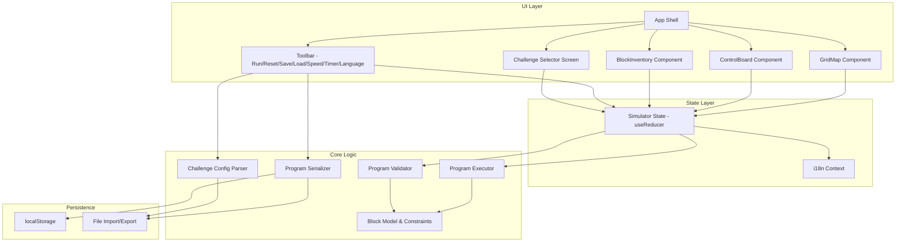

# Design Document: Matatalab Coding Set Simulator

## Overview

The Matatalab Simulator is a single-page web application that replicates the physical Matatalab Coding Set experience in a browser. It targets primary school students preparing for coding competitions in Hong Kong/Chinese-speaking regions.

The application is built with:
- **TypeScript** for type safety across the codebase
- **React 18** for UI rendering and component architecture
- **Vite** for build tooling and development server
- **CSS Modules** for scoped styling with responsive layout
- **fast-check** for property-based testing
- **Vitest** for unit and property-based test runner

The simulator runs entirely client-side with no backend. State is managed via React context and `useReducer`. Programs and challenge configs are persisted to `localStorage` and can be exported/imported as JSON files.

### Key Design Decisions

1. **No backend**: All logic runs in the browser. Saves go to `localStorage` or file download. This keeps deployment simple (static hosting) and avoids latency.
2. **TypeScript + React**: Widely adopted, strong typing for the complex block/execution model, large ecosystem for drag-and-drop (dnd-kit).
3. **Reducer-based state**: The program execution model is inherently sequential and state-driven. A reducer cleanly models transitions (place block, remove block, execute step, reset).
4. **JSON for serialization**: Both program save/load and challenge configuration use JSON. This aligns with requirements 13 and 14 and enables round-trip testing.
5. **i18n via react-i18next**: Lightweight, supports runtime language switching without page reload, and handles Traditional Chinese well.

## Architecture



### Data Flow

1. User drags a block from `BlockInventory` → dispatch `PLACE_BLOCK` action → reducer updates `controlBoard` state and decrements inventory count.
2. User presses Run → `Validator` checks program structure → if valid, `Executor` begins stepping through instructions → each step dispatches `EXECUTE_STEP` which updates `matataBotPosition` and `currentBlockIndex`.
3. Animation is driven by a `setInterval`/`setTimeout` loop whose delay is determined by the speed setting.
4. On completion, the executor checks goal conditions (position + collectibles) and dispatches `EXECUTION_COMPLETE` with success/failure.


## Components and Interfaces

### UI Components

#### `App`
Root component. Manages top-level layout, routing between challenge selector and simulator view, and provides state/i18n context.

#### `GridMap`
Renders the NxN grid. Props: `gridSize`, `cells` (obstacle/goal/collectible markers), `botPosition`, `botDirection`, `animationState`.
- Uses CSS Grid for layout
- Scales cell size to fit viewport: `cellSize = min(availableWidth, availableHeight) / gridSize`
- Renders MatataBot as an SVG/icon with rotation transform for direction

#### `ControlBoard`
Displays program lines. Supports drag-and-drop reordering within lines.
- Line 0: main program
- Line 1+: function definition(s)
- Drop zones between blocks for insertion
- Highlights the currently executing block during execution

#### `BlockInventory`
Displays available blocks with remaining counts. Blocks with count 0 are visually disabled (greyed out, non-draggable).

#### `Toolbar`
Contains: Run, Reset, Save, Load, Speed selector, Timer controls, Language toggle.

#### `ChallengeSelector`
Lists available challenges with title and difficulty badge. Clicking a challenge loads its configuration.

### Core Logic Modules

#### `ProgramValidator`
```typescript
interface ValidationResult {
  valid: boolean;
  errors: ValidationError[];
}

interface ValidationError {
  type: 'UNMATCHED_LOOP_BEGIN' | 'UNMATCHED_LOOP_END' | 'MISSING_LOOP_NUMBER' 
      | 'FUNCTION_CALL_NO_DEFINITION' | 'FUNCTION_ON_MAIN_LINE' 
      | 'NUMBER_ON_TURN' | 'BOUNDARY_VIOLATION' | 'OBSTACLE_COLLISION';
  blockIndex: number;
  line: number;
  messageKey: string; // i18n key
}

function validateProgram(board: ControlBoardState): ValidationResult;
```

#### `ProgramExecutor`
```typescript
interface ExecutionState {
  status: 'idle' | 'running' | 'paused' | 'completed' | 'error';
  currentLine: number;
  currentBlockIndex: number;
  botPosition: Position;
  botDirection: Direction;
  collectedItems: string[];
  loopCounters: Map<number, number>; // blockIndex -> remaining iterations
  callStack: StackFrame[];
  stepCount: number;
}

interface StackFrame {
  line: number;
  blockIndex: number;
  returnLine: number;
  returnBlockIndex: number;
}

function createExecutor(
  board: ControlBoardState,
  grid: GridState,
  speed: SpeedSetting
): ProgramExecutor;

interface ProgramExecutor {
  step(): ExecutionState;    // advance one instruction
  run(): void;               // auto-step with animation delay
  reset(): ExecutionState;   // return to initial state
  setSpeed(speed: SpeedSetting): void;
}
```

#### `ProgramSerializer`
```typescript
interface SerializedProgram {
  version: 1;
  lines: SerializedLine[];
}

interface SerializedLine {
  lineIndex: number;
  blocks: SerializedBlock[];
}

interface SerializedBlock {
  type: BlockType;
  parameter?: number | 'random';
}

function serialize(board: ControlBoardState): SerializedProgram;
function deserialize(json: string): ControlBoardState; // throws on invalid input
```

#### `ChallengeConfigParser`
```typescript
interface ChallengeConfig {
  id: string;
  title: Record<'zh' | 'en', string>;
  difficulty: 'easy' | 'medium' | 'hard';
  grid: {
    width: number;
    height: number;
  };
  start: { row: number; col: number; direction: Direction };
  goals: Position[];
  obstacles: Position[];
  collectibles: Position[];
  blockInventory: Partial<Record<BlockType, number>>;
  timeLimit?: number; // seconds, optional
}

function parseChallenge(json: string): ChallengeConfig; // throws on invalid
function prettyPrintChallenge(config: ChallengeConfig): string;
```

### Drag-and-Drop

Using `@dnd-kit/core` + `@dnd-kit/sortable`:
- `BlockInventory` items are `Draggable` sources
- `ControlBoard` lines are `Droppable` targets with `SortableContext` for reordering
- Dragging from board back to inventory triggers removal


## Data Models

### Block Types

```typescript
type Direction = 'north' | 'east' | 'south' | 'west';

type BlockType =
  | 'forward'
  | 'backward'
  | 'turn_left'
  | 'turn_right'
  | 'loop_begin'
  | 'loop_end'
  | 'function_define'
  | 'function_call'
  | 'number_2'
  | 'number_3'
  | 'number_4'
  | 'number_5'
  | 'number_random'
  | 'fun_random_move'
  | 'fun_music'
  | 'fun_dance';

interface CodingBlock {
  id: string;          // unique instance ID (uuid)
  type: BlockType;
  parameter?: number | 'random'; // resolved at execution for random
}

interface Position {
  row: number;
  col: number;
}
```

### State Models

```typescript
interface ControlBoardState {
  lines: ProgramLine[];
}

interface ProgramLine {
  lineIndex: number;
  blocks: CodingBlock[];
}

interface GridState {
  width: number;
  height: number;
  obstacles: Position[];
  goals: Position[];
  collectibles: Position[];
}

interface SimulatorState {
  // Grid
  grid: GridState;
  
  // Bot
  botPosition: Position;
  botDirection: Direction;
  botStartPosition: Position;
  botStartDirection: Direction;
  
  // Program
  controlBoard: ControlBoardState;
  blockInventory: Record<BlockType, number>;
  
  // Execution
  execution: ExecutionState;
  speed: SpeedSetting;
  
  // Challenge
  currentChallenge: ChallengeConfig | null;
  collectedItems: Position[];
  
  // Timer
  timer: {
    enabled: boolean;
    duration: number;   // seconds
    remaining: number;  // seconds
    running: boolean;
  };
  
  // UI
  language: 'zh' | 'en';
}

type SpeedSetting = 'slow' | 'normal' | 'fast';

// Speed mapping (ms delay between steps)
const SPEED_DELAYS: Record<SpeedSetting, number> = {
  slow: 1500,
  normal: 800,
  fast: 300,
};
```

### Default Block Inventory (Physical Set Limits)

```typescript
const DEFAULT_BLOCK_INVENTORY: Record<BlockType, number> = {
  forward: 4,
  backward: 4,
  turn_left: 4,
  turn_right: 4,
  loop_begin: 2,
  loop_end: 2,
  function_define: 1,
  function_call: 3,
  number_2: 2,
  number_3: 2,
  number_4: 2,
  number_5: 2,
  number_random: 2,
  fun_random_move: 1,
  fun_music: 1,
  fun_dance: 1,
};
```

### Reducer Actions

```typescript
type SimulatorAction =
  | { type: 'PLACE_BLOCK'; blockType: BlockType; line: number; position: number }
  | { type: 'REMOVE_BLOCK'; blockId: string }
  | { type: 'REORDER_BLOCK'; blockId: string; newLine: number; newPosition: number }
  | { type: 'RUN_PROGRAM' }
  | { type: 'EXECUTE_STEP'; state: ExecutionState }
  | { type: 'EXECUTION_COMPLETE'; success: boolean; error?: ValidationError }
  | { type: 'RESET' }
  | { type: 'LOAD_CHALLENGE'; config: ChallengeConfig }
  | { type: 'LOAD_PROGRAM'; board: ControlBoardState }
  | { type: 'SET_SPEED'; speed: SpeedSetting }
  | { type: 'SET_LANGUAGE'; language: 'zh' | 'en' }
  | { type: 'TIMER_TICK' }
  | { type: 'TIMER_START'; duration: number }
  | { type: 'TIMER_STOP' }
  | { type: 'TIMER_EXPIRED' };
```


## Correctness Properties

*A property is a characteristic or behavior that should hold true across all valid executions of a system — essentially, a formal statement about what the system should do. Properties serve as the bridge between human-readable specifications and machine-verifiable correctness guarantees.*

### Property 1: Block inventory round-trip (place and remove)

*For any* block type with available count > 0, placing that block on the Control_Board and then removing it back to the Block_Inventory should restore the inventory count to its original value and leave the Control_Board unchanged.

**Validates: Requirements 2.3, 2.4**

### Property 2: Block inventory count is non-negative and bounded

*For any* sequence of place and remove operations on the Block_Inventory, the available count for every block type should remain between 0 and the initial limit (inclusive), and a place operation should be rejected when the count is 0.

**Validates: Requirements 2.2, 2.5**

### Property 3: Reordering preserves block set

*For any* Control_Board state and any reorder operation (moving a block to a new position), the multiset of blocks on the board should remain identical — same block types, same count, same IDs — only positions change.

**Validates: Requirements 2.6**

### Property 4: Motion block moves bot by correct distance

*For any* valid grid position, direction, and motion block (forward or backward) with optional number parameter N (default 1), executing the block should move the MatataBot exactly N cells in the corresponding direction (forward = facing direction, backward = opposite), provided no boundary or obstacle is encountered.

**Validates: Requirements 4.1, 4.2, 4.3**

### Property 5: Random number block produces value in [1, 6]

*For any* execution involving a Random Number_Block (on motion or loop), the resolved value should be an integer between 1 and 6 inclusive.

**Validates: Requirements 4.4, 5.2**

### Property 6: Turn blocks rotate direction without moving

*For any* bot position and direction, executing a Turn Left block should rotate the direction 90° counter-clockwise, and executing a Turn Right block should rotate 90° clockwise. In both cases, the bot's cell position should remain unchanged.

**Validates: Requirements 4.5, 4.6**

### Property 7: Number block on turn is rejected

*For any* program where a Number_Block is placed immediately after a Turn Left or Turn Right block, the validator should reject the program with an appropriate error.

**Validates: Requirements 4.7**

### Property 8: Loop executes enclosed sequence exactly N times

*For any* valid loop construct (Loop Begin + Number N + sequence + Loop End) with N in {2, 3, 4, 5}, the enclosed sequence of blocks should execute exactly N times. The total execution steps from the loop should equal N × (number of blocks in the enclosed sequence).

**Validates: Requirements 5.1**

### Property 9: Loop validation rejects malformed loops

*For any* program containing an unmatched Loop Begin (no Loop End), an unmatched Loop End (no Loop Begin), or a Loop Begin without a Number_Block, the validator should return an error and prevent execution.

**Validates: Requirements 5.3, 5.4, 5.5**

### Property 10: Function call executes the defined subroutine

*For any* program with N Function_Call_Blocks (N ≥ 1) on the main line and a valid Function_Define_Block subroutine on a separate line, the executor should execute the subroutine's block sequence exactly N times, once for each call encountered in order.

**Validates: Requirements 6.1, 6.4**

### Property 11: Function call without definition is rejected

*For any* program containing a Function_Call_Block but no Function_Define_Block on the Control_Board, the validator should return an error and prevent execution.

**Validates: Requirements 6.2**

### Property 12: Function_Define_Block on main line is rejected

*For any* attempt to place a Function_Define_Block on line 0 (the main program line), the simulator should reject the placement with an error.

**Validates: Requirements 3.3, 3.4**

### Property 13: Validation runs before execution

*For any* program with structural errors (unmatched loops, missing function definitions, number on turn), pressing Run should return validation errors without starting execution (execution state remains idle).

**Validates: Requirements 7.1**

### Property 14: Goal checking on execution completion

*For any* completed execution with a challenge loaded, the system should report success if and only if the MatataBot's final position is on a goal cell AND all required collectible items have been collected.

**Validates: Requirements 7.4, 9.4**

### Property 15: Reset preserves program but restores bot state

*For any* simulator state (mid-execution or post-execution), performing a reset should restore the bot position and direction to the challenge start values, clear execution state to idle, clear collected items, but leave the Control_Board blocks unchanged.

**Validates: Requirements 7.5**

### Property 16: Boundary violation stops execution

*For any* bot position on the edge of the grid facing outward, executing a forward motion block should stop execution with a boundary error and identify the causing block.

**Validates: Requirements 7.6, 8.1**

### Property 17: Obstacle collision stops execution

*For any* bot position adjacent to an obstacle cell, executing a motion block that would move the bot into the obstacle should stop execution with a collision error and identify the causing block.

**Validates: Requirements 7.7, 8.2**

### Property 18: Challenge loading initializes state correctly

*For any* valid ChallengeConfig, loading the challenge should set the grid dimensions, place obstacles/goals/collectibles at the specified positions, set the bot at the start position with the start direction, and configure the block inventory to match the challenge's limits.

**Validates: Requirements 1.1, 1.3, 9.2**

### Property 19: Program serialization round-trip

*For any* valid ControlBoardState (any combination of blocks on any number of lines), serializing to JSON and then deserializing should produce an equivalent ControlBoardState — same block types, same parameters, same line assignments, same ordering.

**Validates: Requirements 13.1, 13.2, 13.3, 13.4**

### Property 20: Invalid program JSON is rejected gracefully

*For any* malformed or corrupted JSON string, deserializing should throw/return an error and the Control_Board state should remain unchanged.

**Validates: Requirements 13.5**

### Property 21: Challenge configuration round-trip

*For any* valid ChallengeConfig object, parsing the JSON, pretty-printing it, and parsing again should produce an equivalent ChallengeConfig object.

**Validates: Requirements 14.1, 14.3, 14.4**

### Property 22: Invalid challenge configuration JSON is rejected

*For any* malformed or invalid challenge configuration JSON, parsing should return a descriptive error.

**Validates: Requirements 14.2**

### Property 23: i18n completeness

*For any* i18n key used in the application, both the Traditional Chinese ('zh') and English ('en') translation files should contain a non-empty string value for that key.

**Validates: Requirements 11.3, 11.4**

### Property 24: Non-movement fun blocks preserve position

*For any* bot position and direction, executing a Preset Music or Preset Dancing Fun_Block should not change the bot's position or direction.

**Validates: Requirements 12.2, 12.3**

### Property 25: Random movement fun block moves exactly 1 cell

*For any* bot position with at least one valid adjacent cell, executing a Random Movement Fun_Block should move the bot exactly 1 cell in one of the four cardinal directions.

**Validates: Requirements 12.1**

### Property 26: Timer expiry stops execution

*For any* running execution with an active timer, when the timer reaches zero, execution should stop and the execution status should reflect the timeout.

**Validates: Requirements 10.3**

### Property 27: Speed change applies to next step

*For any* speed change during execution, the delay before the next instruction step should match the new speed setting's delay value, not the previous one.

**Validates: Requirements 16.2**


## Error Handling

### Validation Errors (Pre-Execution)

| Error Type | Trigger | Behavior |
|---|---|---|
| `UNMATCHED_LOOP_BEGIN` | Loop Begin without matching Loop End | Highlight the Loop Begin block, show i18n error message |
| `UNMATCHED_LOOP_END` | Loop End without preceding Loop Begin | Highlight the Loop End block, show i18n error message |
| `MISSING_LOOP_NUMBER` | Loop Begin without a Number_Block | Highlight the Loop Begin block, show i18n error message |
| `FUNCTION_CALL_NO_DEFINITION` | Function_Call without Function_Define on board | Highlight the Function_Call block, show i18n error message |
| `FUNCTION_ON_MAIN_LINE` | Function_Define placed on line 0 | Reject placement, show i18n error message |
| `NUMBER_ON_TURN` | Number_Block placed after Turn block | Reject placement, show i18n error message |

### Runtime Errors (During Execution)

| Error Type | Trigger | Behavior |
|---|---|---|
| `BOUNDARY_VIOLATION` | Bot moves outside grid bounds | Stop execution, highlight causing block, show visual indicator on bot |
| `OBSTACLE_COLLISION` | Bot moves into obstacle cell | Stop execution, highlight causing block, show visual indicator on bot |
| `TIMER_EXPIRED` | Countdown reaches zero | Stop execution, show time-up message |

### Serialization Errors

| Error Type | Trigger | Behavior |
|---|---|---|
| `INVALID_PROGRAM_JSON` | Malformed JSON on program load | Show i18n error, leave Control_Board unchanged |
| `INVALID_CHALLENGE_JSON` | Malformed challenge config JSON | Show i18n error with description of what's wrong |

All error messages use i18n keys so they display in the active language (zh/en).


## Testing Strategy

### Testing Framework

- **Test Runner**: Vitest
- **Property-Based Testing**: fast-check
- **Component Testing**: React Testing Library + jsdom
- **Minimum iterations per property test**: 100

### Dual Testing Approach

#### Property-Based Tests

Each correctness property (Properties 1–27) maps to a single property-based test using fast-check. Tests generate random inputs (block sequences, grid configurations, positions, directions) and verify the property holds across all generated cases.

Each property test must be tagged with a comment:
```
// Feature: matatalab-simulator, Property {N}: {property title}
```

Key property test areas:
- Block inventory state transitions (Properties 1–3)
- Motion execution correctness (Properties 4–6)
- Loop and function execution (Properties 8, 10)
- Validation rules (Properties 7, 9, 11–13)
- Boundary and collision detection (Properties 16–17)
- Serialization round-trips (Properties 19, 21)
- Error rejection (Properties 20, 22)

#### Unit Tests

Unit tests cover specific examples, edge cases, and integration points:
- Default block inventory matches physical set quantities
- Specific challenge loading (built-in easy/medium/hard)
- Language defaults to Traditional Chinese
- Speed defaults to normal
- Timer configuration and free practice mode
- Control board supports at least 2 lines
- At least 3 built-in challenges exist
- Specific error message content for each validation error type
- Edge cases: 1×1 grid movements, all blocks used up, empty program

#### Component Tests

React Testing Library tests for UI interactions:
- Drag-and-drop block placement and removal
- Run/Reset button behavior
- Language toggle switches all visible text
- Speed control UI
- Challenge selector navigation
- Responsive layout breakpoint at 1024px

### Test Organization

```
src/
  core/
    __tests__/
      executor.property.test.ts    # Properties 4-6, 8, 10, 16-17, 24-25
      validator.property.test.ts   # Properties 7, 9, 11-13
      serializer.property.test.ts  # Properties 19-20
      challenge.property.test.ts   # Properties 18, 21-22
      inventory.property.test.ts   # Properties 1-3
      goal.property.test.ts        # Property 14
      state.property.test.ts       # Properties 15, 26-27
      i18n.property.test.ts        # Property 23
      executor.test.ts             # Unit tests for execution
      validator.test.ts            # Unit tests for validation
      serializer.test.ts           # Unit tests for serialization
  components/
    __tests__/
      GridMap.test.tsx
      ControlBoard.test.tsx
      BlockInventory.test.tsx
```
