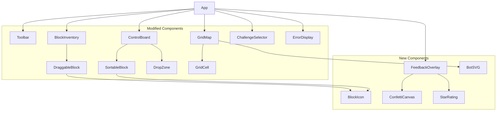

# Design Document: UI/UX Matatalab Refresh

## Overview

This design covers a comprehensive visual refresh of the Matatalab Coding Set Simulator, transforming it from a functional but plain interface into a playful, tactile experience that closely mirrors the physical Matatalab coding set. The refresh touches every visual layer — blocks, bot, grid map, control board, toolbar, and feedback system — while preserving the existing React + TypeScript architecture, state management (useReducer), drag-and-drop (@dnd-kit), and i18n (react-i18next) foundations.

The changes are purely presentational and interaction-feedback oriented. No core logic (executor, validator, serializer, reducer actions) is modified. The refresh adds:

- SVG/emoji icon-based block rendering with 3D physical appearance
- An SVG robot car bot with idle, movement, and error animations
- A nature-themed grid map with terrain illustrations
- Visible control board slots with flow indicators and snap animations
- A playful global theme (rounded font, warm gradients, themed buttons)
- Rich interaction feedback (drag effects, confetti celebrations, error animations)
- Responsive kid-friendly layout with category grouping

### Technology Choices

- **Font**: Nunito (Google Fonts) — rounded, kid-friendly, free, supports Latin + CJK fallback
- **Icons**: Inline SVG components per block type — no external icon library needed, keeps bundle small
- **Animations**: CSS animations + CSS transitions — no animation library needed for the scope described
- **Confetti**: A lightweight `<canvas>`-based confetti burst component (custom, ~80 lines) — avoids adding a dependency for a single effect
- **Theming**: CSS custom properties on `:root` — already partially in place in `index.css`

## Architecture

The refresh follows the existing component architecture. No new top-level components are introduced except a `FeedbackOverlay` for celebration/error overlays and a shared `BlockIcon` component for SVG icon rendering.



### Change Strategy

All changes are additive CSS and JSX modifications to existing components, plus new presentational sub-components. The reducer, executor, validator, serializer, and type definitions remain untouched.

| Layer | Change Type |
|-------|------------|
| `index.css` | Add theme CSS custom properties, import Nunito font |
| `App.css` | Add warm background gradient, safe-area refinements |
| `BlockInventory` | Add `BlockIcon` rendering, category group headers, 3D block styles |
| `ControlBoard` | Add visible empty slots, flow arrows, snap/remove animations |
| `GridMap` | Add nature-themed cells, terrain SVGs, board-game grid lines, BotSVG |
| `Toolbar` | Enlarge Run/Reset buttons, add icons, rounded shapes |
| `ChallengeSelector` | Add rounded cards, difficulty badge colors, hover lift |
| `ErrorDisplay` | Evolve into `FeedbackOverlay` with confetti, star rating, try-again |
| New: `BlockIcon` | Pure SVG icon component mapping `BlockType → SVG` |
| New: `BotSVG` | SVG robot car with idle, rotation, error, fun-action animations |
| New: `FeedbackOverlay` | Full-screen celebration/error overlay with confetti |
| New: `ConfettiCanvas` | Lightweight canvas-based confetti particle burst |
| New: `StarRating` | Star/trophy display based on challenge difficulty |

## Components and Interfaces

### BlockIcon

A pure presentational component that maps a `BlockType` to an inline SVG icon.

```typescript
interface BlockIconProps {
  blockType: BlockType;
  size?: number;       // default 24
  className?: string;
}
```

Icon mapping:
| BlockType | Icon |
|-----------|------|
| `forward` | Up arrow ↑ |
| `backward` | Down arrow ↓ |
| `turn_left` | Curved left arrow ↰ |
| `turn_right` | Curved right arrow ↱ |
| `loop_begin` | Loop/repeat icon ↻ |
| `loop_end` | Closing bracket ] |
| `function_define` | Define icon (gear + pencil) |
| `function_call` | Play/call icon ▶ |
| `number_2..5` | Large digit "2"–"5" |
| `number_random` | Dice icon 🎲 |
| `fun_random_move` | Shuffle arrows ⇄ |
| `fun_music` | Music note ♪ |
| `fun_dance` | Dance figure 💃 |

### BotSVG

An SVG illustration of a simplified robot car with eyes and wheels.

```typescript
interface BotSVGProps {
  direction: Direction;
  isIdle: boolean;
  isError: boolean;
  animationType?: 'music' | 'dance';
  className?: string;
}
```

CSS classes control animations:
- `.bot-idle` — gentle vertical bobbing (translateY ±2px, 2s infinite)
- `.bot-error` — red flash + horizontal shake (translateX ±4px, 0.5s × 3)
- `.bot-music` — musical notes float up from bot
- `.bot-dance` — slight rotation wiggle (±10deg, 0.5s × 2)
- Rotation via `transform: rotate(Xdeg)` with `transition: transform 300ms ease`

### FeedbackOverlay

Replaces the current `ErrorDisplay` toast with a full-screen overlay system.

```typescript
interface FeedbackOverlayProps {
  executionStatus: 'idle' | 'running' | 'paused' | 'completed' | 'error';
  goalReached?: boolean;
  errorInfo?: ValidationError;
  challengeDifficulty?: 'easy' | 'medium' | 'hard';
  language: 'zh' | 'en';
  onDismiss: () => void;
}
```

Behavior:
- **Success**: Full-screen overlay with confetti canvas, star rating, localized congratulatory message. Auto-dismiss after 5 seconds.
- **Failure (no goal)**: Encouraging "try again" message with friendly animation. Auto-dismiss after 5 seconds.
- **Error**: Highlights offending block (via existing `errorBlock` CSS class on ControlBoard) + shows error toast. Auto-dismiss after 5 seconds.
- **Dismiss**: Fade-out within 300ms on user tap or auto-dismiss.

### ConfettiCanvas

A lightweight `<canvas>` element that renders a burst of colored particles.

```typescript
interface ConfettiCanvasProps {
  active: boolean;
  duration?: number;  // default 3000ms
  particleCount?: number; // default 80
}
```

Uses `requestAnimationFrame` for a 2–4 second particle burst. Particles are small colored rectangles with gravity and random velocity. Canvas is absolutely positioned over the overlay.

### StarRating

Displays 1–3 stars or a trophy based on challenge difficulty.

```typescript
interface StarRatingProps {
  difficulty: 'easy' | 'medium' | 'hard';
}
```

Mapping: easy → 1 star, medium → 2 stars, hard → 3 stars + trophy icon.

### Modified Component Changes

#### BlockInventory / DraggableBlock

- Renders `<BlockIcon>` as primary visual, with localized text label below/beside
- Blocks get 3D appearance: `border-radius: 12px`, `box-shadow` for raised edge, subtle inner highlight gradient
- Count badge becomes circular overlay in top-right corner
- Zero-count blocks: `opacity: 0.4` + `filter: grayscale(80%)` (already partially implemented)
- Blocks grouped by category with visible category headers/dividers
- Drag state: scale to 110%, elevated shadow

#### ControlBoard

- Empty slots rendered as visible rounded rectangles with dashed outline and subtle background tint
- Main line vs function line distinguished by background color + icon in header label
- Flow indicator: small arrow SVG or CSS connector line between placed blocks
- Snap animation on place: brief scale-bounce (scale 1→1.1→1, 150ms)
- Remove animation: fade + shrink (opacity 1→0, scale 1→0.8, 150ms)
- Empty state: localized placeholder message with hand-drag illustration icon

#### GridMap

- Cells get soft pastel nature-themed backgrounds instead of plain `#f9f9f9`
- Obstacle cells: terrain SVG illustration (rock/tree) replacing `🪨` emoji
- Goal cells: animated flag/trophy SVG replacing `🎯` emoji
- Collectible cells: glowing star/gem SVG replacing `⭐` emoji
- Grid lines: subtle rounded borders on cells for board-game appearance
- Start cell: distinct colored border or home-base icon indicator
- Bot replaced with `<BotSVG>` component

#### Toolbar

- Run button: larger, rounded, green background with play icon
- Reset button: larger, rounded, orange background with reset icon
- All buttons get icons alongside text labels
- Rounded shapes throughout

#### ChallengeSelector

- Cards get `border-radius: 12px`, colored difficulty badges
- Hover/tap: `translateY(-2px)` lift + shadow increase
- Difficulty badge colors: green (easy), orange (medium), red (hard)

#### Global Theme (index.css)

- Import Nunito font from Google Fonts
- Warm light background gradient on `body` / `.app`
- Extended CSS custom properties for all theme colors
- Category colors as CSS custom properties for consistency

## Data Models

No changes to existing data models. The refresh is purely presentational. All existing types in `src/core/types.ts` remain unchanged:

- `BlockType`, `CodingBlock`, `Position`, `Direction` — unchanged
- `SimulatorState`, `ExecutionState`, `GridState` — unchanged
- `SimulatorAction` — unchanged (no new actions needed)

### New CSS Custom Properties

Added to `:root` in `index.css`:

```css
:root {
  /* Theme */
  --font-family: 'Nunito', -apple-system, BlinkMacSystemFont, sans-serif;
  --bg-gradient: linear-gradient(135deg, #fef9ef 0%, #e8f5e9 50%, #e3f2fd 100%);

  /* Category colors (blocks) */
  --color-motion: #bbdefb;
  --color-motion-border: #64b5f6;
  --color-motion-text: #0d47a1;
  --color-loop: #fff9c4;
  --color-loop-border: #fdd835;
  --color-loop-text: #f57f17;
  --color-function: #c8e6c9;
  --color-function-border: #66bb6a;
  --color-function-text: #1b5e20;
  --color-number: #e1bee7;
  --color-number-border: #ab47bc;
  --color-number-text: #4a148c;
  --color-fun: #ffe0b2;
  --color-fun-border: #ffa726;
  --color-fun-text: #e65100;

  /* Grid map */
  --grid-cell-bg: #f0f7e6;
  --grid-cell-border: #d4e4c1;
  --grid-obstacle-bg: #e8dcc8;
  --grid-goal-bg: #d4edda;
  --grid-collectible-bg: #fff8e1;
  --grid-start-border: #4caf50;

  /* Feedback */
  --overlay-bg: rgba(0, 0, 0, 0.5);
  --confetti-duration: 3s;

  /* Buttons */
  --btn-run-bg: #4caf50;
  --btn-run-text: #fff;
  --btn-reset-bg: #ff9800;
  --btn-reset-text: #fff;

  /* Block 3D effect */
  --block-shadow: 0 3px 0 rgba(0,0,0,0.15), 0 4px 8px rgba(0,0,0,0.1);
  --block-radius: 12px;
}
```

### Animation Keyframes

Defined in component CSS modules or a shared `animations.css`:

| Animation | Duration | Description |
|-----------|----------|-------------|
| `idle-bob` | 2s infinite | translateY(0 → -2px → 0) |
| `error-shake` | 0.5s × 3 | translateX(0 → -4px → 4px → 0) + red flash |
| `snap-bounce` | 150ms | scale(1 → 1.1 → 1) |
| `fade-shrink` | 150ms | opacity(1→0) + scale(1→0.8) |
| `pulse-glow` | 1s infinite | box-shadow pulse on drop zone |
| `confetti-fall` | 3s | particle gravity simulation on canvas |
| `goal-flag-wave` | 1.5s infinite | slight rotation oscillation |
| `star-glow` | 2s infinite | opacity pulse on collectible |


## Correctness Properties

*A property is a characteristic or behavior that should hold true across all valid executions of a system — essentially, a formal statement about what the system should do. Properties serve as the bridge between human-readable specifications and machine-verifiable correctness guarantees.*

### Property 1: Every block type has an icon

*For any* `BlockType` value, rendering `BlockIcon` with that type should produce a non-empty SVG element as the primary visual identifier.

**Validates: Requirements 1.1**

### Property 2: Block renders icon with localized label

*For any* `BlockType` and any language setting (`zh` or `en`), the rendered block in the inventory should contain both an icon element and a text label matching the i18n translation for that block type and language.

**Validates: Requirements 1.7**

### Property 3: Block category color mapping is consistent

*For any* `BlockType`, the CSS category class applied to the rendered block should match the expected category (motion→blue, loop→yellow, function→green, number→purple, fun→orange), and this mapping should be identical between `BlockInventory` and `ControlBoard`.

**Validates: Requirements 1.8**

### Property 4: Block 3D appearance invariants

*For any* `BlockType`, the rendered block element should have a border-radius of at least 12px, a non-empty box-shadow style, and a visible count badge element.

**Validates: Requirements 2.1, 2.2, 2.5**

### Property 5: Zero-count blocks are visually disabled

*For any* `BlockType` with inventory count of 0, the rendered block should have reduced opacity and a grayscale filter applied (via the disabled CSS class).

**Validates: Requirements 2.4**

### Property 6: Bot rotation matches direction

*For any* `Direction` value (north, east, south, west), the `BotSVG` component should apply a CSS transform rotation matching the expected degrees (north→0°, east→90°, south→180°, west→270°).

**Validates: Requirements 3.2**

### Property 7: Special grid cells render SVG illustrations

*For any* grid cell that is an obstacle, goal, or collectible, the rendered cell should contain an SVG illustration element rather than a plain text emoji.

**Validates: Requirements 4.2, 4.3, 4.4**

### Property 8: Flow indicators between placed blocks

*For any* control board program line containing N placed blocks (where N ≥ 2), the rendered line should contain exactly N−1 flow indicator elements between the blocks.

**Validates: Requirements 5.5**

### Property 9: Toolbar buttons have icons and text

*For any* toolbar action button, the rendered button should contain both an icon element and a visible text label.

**Validates: Requirements 6.4**

### Property 10: Challenge cards have correct difficulty badge

*For any* `ChallengeConfig`, the rendered challenge card should display a difficulty badge with the CSS class corresponding to its difficulty level (easy→green, medium→orange, hard→red).

**Validates: Requirements 6.5**

### Property 11: Block inventory groups by category

*For any* block inventory state, the rendered `BlockInventory` should group blocks by category (motion, loop, function, number, fun) with visible category header elements, and blocks within each group should all belong to the same category.

**Validates: Requirements 8.4**

### Property 12: Accessibility attributes preserved

*For any* interactive element (blocks, buttons, drop zones) in the refreshed UI, the element should have appropriate ARIA attributes (`role`, `aria-label` or `aria-labelledby`, `tabIndex`) and keyboard event handlers.

**Validates: Requirements 8.6**

### Property 13: Star rating matches difficulty

*For any* challenge difficulty level, the `StarRating` component should render the correct number of stars (easy→1, medium→2, hard→3).

**Validates: Requirements 9.1**

### Property 14: Success message is localized

*For any* language setting (`zh` or `en`), when a challenge is completed successfully, the congratulatory message displayed by `FeedbackOverlay` should match the i18n translation for that language.

**Validates: Requirements 9.3**

## Error Handling

### Graceful Degradation

- **Font loading failure**: If Nunito fails to load from Google Fonts, the CSS `font-family` stack falls back to system sans-serif fonts. No functional impact.
- **SVG rendering failure**: If an SVG icon fails to render (e.g., missing path data), the `BlockIcon` component falls back to the existing text label. The text label is always present as a secondary identifier.
- **Canvas not supported**: If `<canvas>` is unavailable (extremely rare in modern browsers), the `ConfettiCanvas` component renders nothing. The celebration overlay still shows the star rating and message.
- **Animation performance**: All animations use CSS transforms and opacity (GPU-composited properties). On low-end devices, animations degrade gracefully — they may stutter but won't block interaction.

### Existing Error Handling Preserved

- Validation errors continue to flow through the reducer → `ExecutionState.errorInfo` → `FeedbackOverlay`
- Block placement errors (inventory exhausted) continue to be silently rejected by the reducer
- File load errors continue to show an alert via the Toolbar

## Testing Strategy

### Dual Testing Approach

This feature uses both unit tests and property-based tests for comprehensive coverage.

**Unit tests** cover:
- Specific icon mappings for each block type (Requirements 1.2–1.6)
- Bot idle animation class when execution is idle (Requirement 3.3)
- Bot error indicator when errorInfo is present (Requirement 3.5)
- Bot fun-action animation indicators (Requirement 3.6)
- Start cell visual indicator rendering (Requirement 4.6)
- Empty control board placeholder message (Requirement 5.6)
- Main vs function line visual distinction (Requirement 5.2)
- Toolbar Run/Reset button styling (Requirement 6.3)
- Drag state CSS class application (Requirement 7.1)
- Drop zone active state highlighting (Requirement 7.2)
- Success overlay rendering with confetti (Requirement 7.4)
- Try-again message on failure (Requirement 7.5)
- Error block highlighting (Requirement 7.6)
- Confetti canvas activation (Requirement 9.2)
- Auto-dismiss after 5 seconds (Requirement 9.4)

**Property-based tests** cover:
- Properties 1–14 as defined in the Correctness Properties section
- Each property test runs a minimum of 100 iterations
- Uses `fast-check` (already in devDependencies) for property-based testing

### Property-Based Testing Configuration

- **Library**: `fast-check` v4.x (already installed)
- **Minimum iterations**: 100 per property test
- **Tag format**: Each test is tagged with a comment: `// Feature: uiux-matatalab-refresh, Property {N}: {title}`
- **Each correctness property is implemented by a single property-based test**

### Test File Organization

```
src/components/__tests__/
  BlockIcon.test.tsx          — Properties 1, 2, 3
  BlockAppearance.test.tsx    — Properties 4, 5
  BotSVG.test.tsx             — Property 6
  GridMapCells.test.tsx       — Property 7
  ControlBoardSlots.test.tsx  — Property 8
  ToolbarRefresh.test.tsx     — Property 9
  ChallengeCards.test.tsx     — Property 10
  BlockInventoryGroups.test.tsx — Property 11
  Accessibility.test.tsx      — Property 12
  FeedbackOverlay.test.tsx    — Properties 13, 14
```
